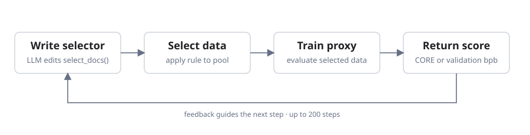

<div align="center">

# AutoData

**Agentic search for pre-training data selection**

[](LICENSE)
[](https://huggingface.co/datasets/WecoAI/autodata-climbmix-features)
[](https://www.python.org/)

</div>

AutoData automates pre-training data selection. An LLM writes a Python
`select_docs()` function that chooses documents from a training corpus. AutoData
then trains a small proxy language model on a subsample of those documents and
evaluates it. WECO uses the score to guide the LLM's next revision, repeating this
[AIDE](https://github.com/wecoai/aideml)-style search loop.

<p align="center">
  
</p>

You can use AutoData in two ways:

- **Train with an existing selector:** complete setup, choose an
  [included recipe](#included-recipes), and [train new models](#4-train-new-models-with-a-discovered-recipe).
  This does not require an LLM or a new search.
- **Discover a new selector:** complete setup and [run a search](#3-run-a-search)
  with your chosen LLM and evaluation objective.

The included setup uses ClimbMix, precomputed document features, and
[nanochat](https://github.com/karpathy/nanochat) for training. Local GPUs are the
default; Modal is an optional backend for training from a recipe.

## 1. Install

You need Git, Python 3.10 or newer, and
[`uv`](https://docs.astral.sh/uv/getting-started/installation/).

```bash
git clone https://github.com/WecoAI/AutoData.git
cd AutoData

uv venv --python 3.11 .venv-run
uv pip install --python .venv-run/bin/python \
    weco huggingface_hub numpy pyarrow
source .venv-run/bin/activate

cp .env.example .env
$EDITOR .env
source .env

git clone https://github.com/karpathy/nanochat.git "$AUTODATA_NANOCHAT_ROOT"
(cd "$AUTODATA_NANOCHAT_ROOT" && uv venv && uv sync --extra gpu)
```

Authenticate for dataset downloads if required by the dataset's access settings:

```bash
hf auth login
```

To run a new search, also run `weco login` and export `OPENAI_API_KEY`,
`ANTHROPIC_API_KEY`, or `GEMINI_API_KEY` for the LLM selected in the launcher.

Configuration lives in three places:

| File | Configure |
|---|---|
| [`.env.example`](.env.example) | Data paths, local GPUs, staging, and output |
| [`search/launch/run.sh`](search/launch/run.sh) | LLM, proxy, metric, and search length |
| [`search/instructions/`](search/instructions/) | Target, budget, features, and objective |

Source `.env` in every new shell.

## 2. Get the data

The published experiments use ClimbMix and an aligned feature bank:

```bash
hf download karpathy/climbmix-400b-shuffle --repo-type dataset \
    --local-dir "$AUTODATA_POOL_DIR"

hf download WecoAI/autodata-climbmix-features --repo-type dataset \
    --local-dir "$AUTODATA_FEATURES_DIR"
```

Prepare nanochat's tokenizer once:

```bash
(cd "$AUTODATA_NANOCHAT_ROOT" && \
    .venv/bin/python -m nanochat.dataset -n 8 && \
    .venv/bin/python -m scripts.tok_train)
```

Check the paths, parquet schema, feature alignment, and selector contract:

```bash
python -m pipeline.check_setup
```

The corpus contains 6,543 parquet shards (about 600 GB).
`shard_06542.parquet` is held out for validation. The 22.7 GiB feature bank
aligns with the training documents through `shard_offsets.json`.

### Using another pool

The current search path expects:

- flat `shard_*.parquet` files with a `text` column;
- a separate validation shard set by `AUTODATA_VAL_SHARD`;
- one-dimensional feature arrays in global shard-and-row order; and
- `shard_offsets.json` mapping that order back to the shards.

For a different schema or raw-text-only search, adapt the
[selector template](search/data_select_template.py), instruction file, and
evaluator together. The [dataset card](DATASET_CARD.md) defines the published
feature schema.

## 3. Run a search

The default launcher runs 200 search steps, optimizes CORE (higher is better),
and uses a depth-8 proxy model. Each candidate requires proxy training, so a
search is substantially more expensive than running the selector alone.

Before launching:

1. Put the target model and document budget in the instruction file.
2. Pair `core / maximize` with `full_core.md`, or `val_bpb / minimize` with
   `full.md`.
3. Set the LLM and `AUTODATA_EVAL_DEPTH` in `search/launch/run.sh`.

Depth 8 is the published default. Depth 12 is a larger, more expensive proxy.

```bash
source .venv-run/bin/activate
source .env
bash search/launch/run.sh
```

The default evaluator trains two proxy seeds in parallel. Set
`AUTODATA_WECO_GPUS` to exactly two local GPU IDs, such as `0,1`. Its training
settings use FP8 and are configured for H100 GPUs.

WECO starts from uniform sampling and rewrites
[`search/data_select_template.py`](search/data_select_template.py). Candidates
must return exactly `budget` sorted, unique `int64` document IDs and be
deterministic for a given seed:

```python
def select_docs(budget: int, seed: int) -> np.ndarray:
    ...
```

WECO stores run history and outputs under `.runs/`.

## 4. Train new models with a discovered recipe

The output of search is a **data-selection recipe**: a Python file containing
`select_docs()` and its document `BUDGET`. Once discovered, the same recipe can
select training data for new models at different sizes. Each target model is
trained from scratch; proxy-model weights are not reused.

For example, a recipe discovered with a small `d8` proxy can be used to select
data for a larger `d24` model. This separates the cost of discovering a selection
rule from the cost of training the final model.

### Choose a recipe and target model

Use one of the [included recipes](#included-recipes), or save the selector from
your chosen WECO search step as a Python file under `recipes/`. Pass that file
to `--selector`; it must expose `select_docs()` and `BUDGET`.

The included training backend supports nanochat models at these depths:

| Setting | Available values | Meaning |
|---|---|---|
| `--sizes` | `d8`, `d12`, `d16`, `d20`, `d24` | Target model depth; for example, `d24` has 24 transformer layers |
| `--selector` | Path to a recipe `.py` file | The document-selection rule to reuse |
| `--gpus` | Local CUDA device IDs | GPUs assigned to each training job |
| `--key` | A unique experiment name | Names the cached selection and training outputs |
| `--ratio` | Positive integer | Training tokens per nanochat scaling parameter; defaults to 10 for `d8`–`d20`, 8 for `d24` |

The data-selection budget and the model's training-token budget are separate:
the recipe chooses a document pool, while the model size and `--ratio` determine
how many tokens training consumes. Detailed training defaults are defined in
[`pipeline/train_local.py`](pipeline/train_local.py).

### Example: train a larger model on AutoData-selected data

This command applies the included GPT-5.5 CORE recipe and trains fresh `d24`
models on the selected data, using eight local GPUs:

```bash
source .venv-run/bin/activate
source .env

python -m pipeline.build_and_launch \
    --selector recipes/autodata_core_gpt55_step105.py \
    --key core_gpt55_step105 \
    --sizes d24 \
    --train-seeds 42 43 44 \
    --gpus 0,1,2,3,4,5,6,7
```

The launcher runs the selector, writes the selected documents to Parquet files,
and starts nanochat training. It evaluates each trained model using validation
bits per byte (lower is better) and CORE (higher is better).

To evaluate the same recipe across several larger model sizes, use
`--sizes d16 d20 d24` and a new `--key`, such as `core_gpt55_transfer`.
For comparisons between selectors, keep the target model, training-token
budget, and evaluation settings the same.

The supplied configurations use FP8 and batch sizes intended for H100 GPUs.
For a smaller local run, choose `d8` and adjust precision and batch size:

```bash
python -m pipeline.build_and_launch \
    --selector recipes/autodata_core_gpt55_step105.py \
    --key local_d8 \
    --sizes d8 \
    --sub-seeds-d8 42 \
    --gpus 0 \
    --no-fp8 \
    --device-batch-size 4
```

Useful overrides are `--gpus`, `--no-fp8`, `--device-batch-size`,
`--total-batch-size`, `--max-seq-len`, `--ratio`, and `--timeout-hours`.
Other model architectures require adapting the training backend; `--sizes`
selects among the supported nanochat configurations.

### Outputs and storage

Local jobs run serially on the GPUs you select. Outputs are stored in:

| Location | Contents |
|---|---|
| `AUTODATA_STAGE_DIR` | Cached document IDs and materialized training Parquets |
| `AUTODATA_LOCAL_RUNS_DIR` (default: `results/local_runs`) | Per-run training logs and checkpoints |
| `pipeline/<key>_local.json` | Final metrics and output paths; override with `--out` |

Allow about 25 GB for a materialized selection and additional space for model
checkpoints. Set `AUTODATA_STAGE_DIR` to a fast local disk if `/dev/shm` is too
small. Use a new `--key` when changing the recipe or selection budget to avoid
reusing cached document IDs.

Generated results and run outputs are ignored by Git. No experiment result
files are included in this repository.

### Optional: train on Modal

The same recipe-to-training workflow can use Modal GPUs. Install and
authenticate Modal, then create the volumes configured in `.env` and upload
the validation shard:

```bash
uv pip install --python .venv-run/bin/python modal
modal token new
modal volume create "$AUTODATA_SCRATCH_VOL"
modal volume create "$AUTODATA_ARCHIVE_VOL"
modal volume put "$AUTODATA_ARCHIVE_VOL" "$AUTODATA_VAL_SHARD" /val_shard.parquet
modal deploy pipeline/modal_train.py

python -m pipeline.build_and_launch \
    --backend modal \
    --selector recipes/autodata_core_gpt55_step105.py \
    --key core_gpt55_modal \
    --sizes d24 \
    --train-seeds 42 43 44
```

The launcher materializes data locally, uploads it, and submits training jobs.
It writes call handles to `pipeline/<key>_modal.json`. Add `--parallel` to run
each training job in its own Modal container.

## Included recipes

The six included recipes are Python selectors discovered by WECO, one for each
LLM and objective pair. All use `BUDGET = 14,374,266` documents and load features
from `AUTODATA_FEATURES_DIR`. Pass a recipe to `--selector` in the training
command above; the filename records the search step from which it was saved.

| Objective | GPT-5.5 | Claude Opus 4.7 | Gemini 3 Pro |
|---|---|---|---|
| CORE | [`step105`](recipes/autodata_core_gpt55_step105.py) | [`step63`](recipes/autodata_core_opus47_step63.py) | [`step93`](recipes/autodata_core_gemini3pro_step93.py) |
| Validation bpb | [`step149`](recipes/autodata_valbpb_gpt55_step149.py) | [`step93`](recipes/autodata_valbpb_opus47_step93.py) | [`step112`](recipes/autodata_valbpb_gemini3pro_step112.py) |

`d8` and `d12` train on fixed 880,000- and 2,310,000-document subsamples.
Larger sizes use the full selection. Do not deploy a recipe above the budget it
was searched under.

### Start a search from an existing recipe

To use a recipe as the starting point for a new search, replace the selector
template with that recipe, then run the standard launcher:

```bash
source .venv-run/bin/activate
source .env
cp recipes/autodata_core_gpt55_step105.py search/data_select_template.py
bash search/launch/run.sh
```

This overwrites the current template. Set the desired LLM and matching objective
in `search/launch/run.sh` before launching, as described in
[Run a search](#3-run-a-search).

## Repository guide

| Path | Contents |
|---|---|
| [`search/`](search/) | WECO launchers, selectors, prompts, and evaluation |
| [`pipeline/`](pipeline/) | Materialization and local or Modal training |
| [`recipes/`](recipes/) | Pre-discovered selectors |
| [`eval/`](eval/) | Training-configuration calculations |
| [`DATASET_CARD.md`](DATASET_CARD.md) | Feature-bank schema and provenance |

## Data and licenses

- Code: [MIT](LICENSE).
- Published feature bank: CC BY-NC 4.0 (non-commercial).
- Corpus: [NVIDIA Nemotron-ClimbMix terms](https://huggingface.co/datasets/nvidia/Nemotron-ClimbMix).

The training stack is [karpathy/nanochat](https://github.com/karpathy/nanochat),
and the raw pool is
[karpathy/climbmix-400b-shuffle](https://huggingface.co/datasets/karpathy/climbmix-400b-shuffle).

## Citation 

@misc{autodataselection2026,
  title         = {{AutoData}: Agentic Search for Pre-training Data Selection},
  author        = {Yan Meng and Dhruv Srikanth and Bingchen Zhao and Zhengyao Jiang and Yuxiang Wu},
  year          = {2026},
  eprint        = {2609.19754},
  archivePrefix = {arXiv},
  primaryClass  = {cs.AI},
  url           = {https://arxiv.org/abs/2609.19754}
}
